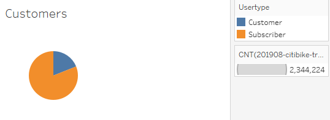
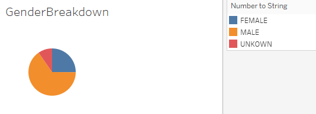
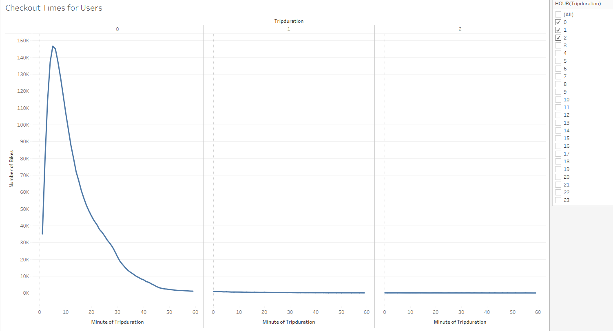
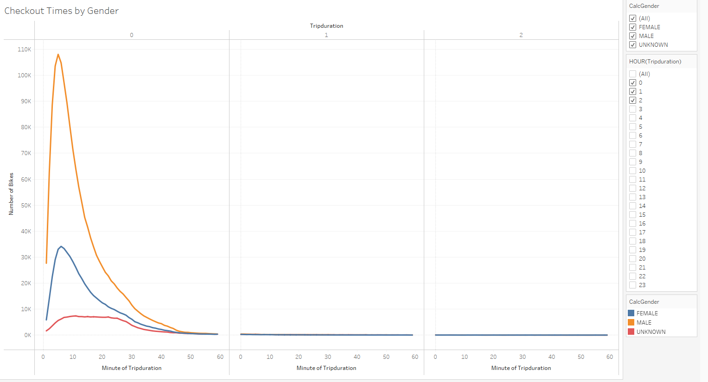
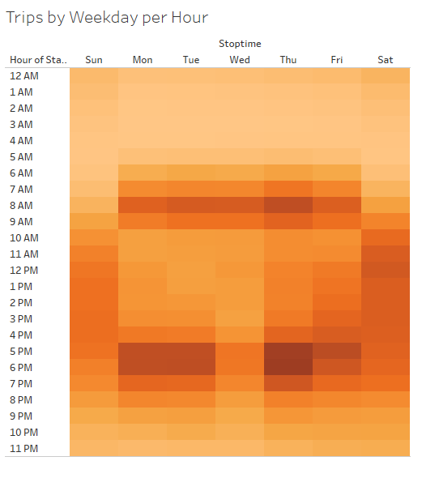
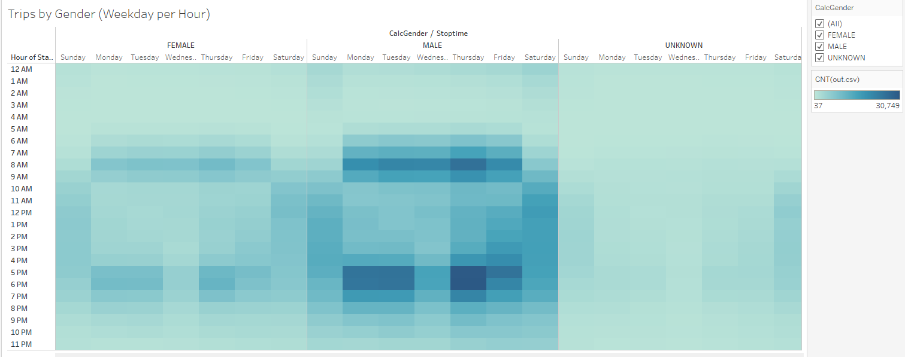
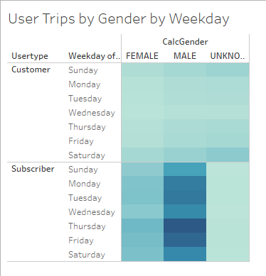

# bikesharing
## Overview
The purpose of this project is to analyze usage data for the NYC Citibike program with the goal of transporting the program to Des Moines.  The visualizations can also be found here: 

[link to dashboard](https://public.tableau.com/app/profile/christine6626)

## Results
Subscribers make up the majority of the Citibike customer base.

The majority of riders are male, but signficiant percentage are female.

Most rides are under an hour by a significant margin.

This trend is prevalent across genders.

During the week, morning and afternoon commute times see the most usage.

This trend is also prevelent across genders, with male-identified riders again showing generally higher usage.

The most consistent riders are male-identified subscribers.

## Summary
These results indicate that male-identified subscribers represent the largest portion of citibike users.  However, women-identified riders display similar usage patterns in both time and length of ride.  This suggests that women have a similar need for and benefit from the bikeshare program, and increased outreach to these riders may increase their usage.  

Further visualizations may include identifying if groups or pairs of bikes share start and stop times and locations to determine if the bikeshare program is being used socially.  This visualization could be further refined by looking at how people of different genders or backgrounds approach riding individually or in groups.  Additionally, one could pull data corresponding to holidays to see if tourist traffic drives usage or usage may actually go down if the commuters that make up the customer-base aren't checking out bikes.